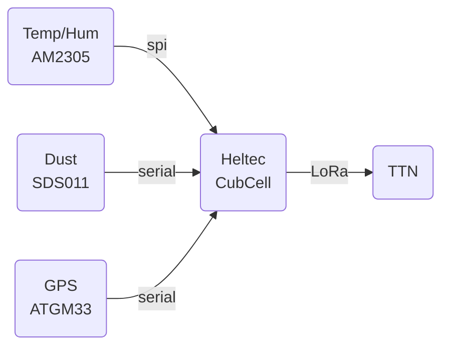

# Software for Hittestress 2021 Node

The hittestress node is based on a Heltec SpaceCube board. This board offers besides a good LoRa stack, deep sleep facilities, LiPo power management, enough program memory and sufficient IO possibilities, see https://heltec.org/project/htcc-ab01/

### System Overview
Three sensors are connected to the node:

The Sensor sends each two minutes the Temperature, Humidity, Dust, PM10/PM2,5 and battery level to TTN. Each 2 hours also the GPS position of the sensor is send to TTN.

### Prototype
The development is currently in a prototyping phase. 
Below the prototype wiring diagram. 

### Power management
The sensor is powered by 220V at night and during daylight the sensor is powered by the 3.7V LiPo.  At night the LiPo is charged.
To save power consumption, the CubeCell is forced in a deep sleep between two message cycles. The GPS is powered via pin Vext, which is only active when requesting the GPS location.  The dust sensor SDS011 is forced in a sleep by a software command. The SDS011 air-fan needs 5V, so a DC step-up is placed in the supply line.

### Software prerequisites
- Arduino development environmnet minumum version 1.8
- Cube-Cell Development Framework V1.1 (can be installed in the Arduino board manager)
- DHT Adafruit sensor library
- TinyGPS++ library  (Mikal Hart)

The LoRa stack and the SoftwareSerial is part of the CubeCell core, the adapted SDS011 library is present in the Hittestress source code.

### Arduino settings
Be sure that the correct board is selected and select the correct Lorawan parameters in the Arduino->tools:
- Board: CubeCel-Board (HTTC-AB01)
- LORAWAN settings: 
  - REGION_EU868
  - CLASS_A
  - OTAA
  - ADR ON
  - Upload UNCONFIRMED
  - Net Reservation OFF,
  - AT Support ON,
  - RGB ACTIVE
  - Debug None

### Payload binary 
Messages are sent on TTN port 15. The format of te payload is:
- byte 0, 1:  Int16; Temperature * 100
- byte 2, 3: Int16; Humidity * 100
- byte 4, 5: Int16; PM10 * 100
- byte 6, 7: Int16; PM2.5 * 100
- byte 8, 9: Int16; Vbat * 1000
- byte 10-13: Float: Latitude #
- byte 14-17: Float: Longitude 

Note: Latitude and Longitude are only present once per 4 hours
