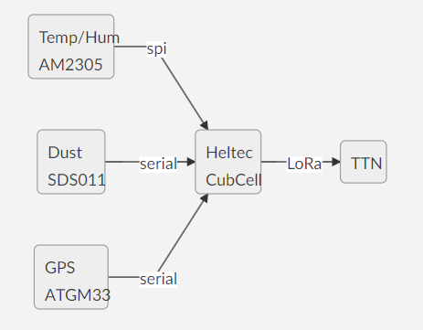

# Software for Hittestress 2021 Node

The hittestress node is based on a Heltec SpaceCube board. This board offers besides a good LoRa stack, deep sleep facilities, LiPo power management, enough program memory and sufficient IO possibilities, see https://heltec.org/project/htcc-ab01/

### System Overview
Three sensors are connected to the node:



The Sensor sends each two minutes the Temperature, Humidity, Dust, PM10/PM2,5 to TTN. Each 4 hours the Status and GPS position of the sensor is send to TTN.

### Prototype
The development is currently in a prototyping phase. 
Below the prototype wiring diagram. 


### Power management
AT night the sensor is powered by 220V, during daylight the sensor is powered by the 3.7V LiPo. At night the LiPo will be charged.
To save power consumption, the CubeCell is forced into a deep sleep between two message cycles.  The GPS is powered via pin Vext, which is only active when requesting the GPS location.  The dust sensor SDS011 is forced in a sleep by a software command. The SDS011 air-fan needs 5V, so a DC step-up is placed in the supply line.

### Software prerequisites
- Arduino development environmnet minumum version 1.8
- Cube-Cell Development Framework V1.3 (can be installed in the Arduino board manager)
- DHT Adafruit sensor library
- TinyGPS++ library (Mikal Hart)

The LoRa stack and the SoftwareSerial is part of the CubeCell core. The adapted SDS011 library is present in the Hittestress source code.

### Arduino settings
Be sure that the correct board is selected and select the correct LoraWan parameters in the menu Arduino->tools:
- Board: CubeCel-Board (HTTC-AB01)
- LORAWAN settings: 
  - REGION_EU868
  - CLASS_A
  - OTAA
  - ADR ON
  - Upload UNCONFIRMED
  - Net Reservation OFF,
  - AT Support OFF,
  - RGB DEACTIVE   !!
  - Debug None

Note: RGB must be deactivated otherwise a conflict occurs with the GPS powersuppply Vext.
  
### TTN keys
The following OTAA keys must be set in the file LoRaWan.h viz. **appEui** and **appKey**.
**devEui** key must be left empty, this one is automatically set from the unique chipid of the HellTec board during startup.
This makes it possible the use of the same code for multiple sensors in your project.

### Payload binary 
Messages are sent on TTN port 15 (measurement data) and port 16 (status data)

Measurement payload on port 15:
- byte 0, 1:  Int16; Temperature * 100
- byte 2, 3: Int16; Humidity * 100
- byte 4, 5: Int16; PM10 * 100
- byte 6, 7: Int16; PM2.5 * 100
- byte 8, 9: Int16; Vbatttery * 1000

Status Payload on port 16:
- byte 0-3: Float: Latitude
- byte 4-7: Float: Longitude
- byte 8, 9: Int16; Altitude
- byte 10,11: InT16; Hdop * 1000
- byte 12,13: Int16; Vbatttery * 1000
- byte 14,15: Int16; Software version * 100

Note: Status message is sent each hour

### Output Payload decoder
The Payload decoder converts the binary payload to Json.<br>
Json example of a measurement message:
```
{ 
  "pm10": 0.9,
  "pm2p5": 0.46,
  "rh": 56.3,
  "temp": 7.5,
  "vbat": 4.17
}
```
Json Example of a status message
```
{ 
  "latitude": 52.2184104,
  "longitude": 5.964393,
  "alt": 56,
  "hdop": 1.8,
  "vbat": 4.026,
  "SwVer": 0.9
}
```